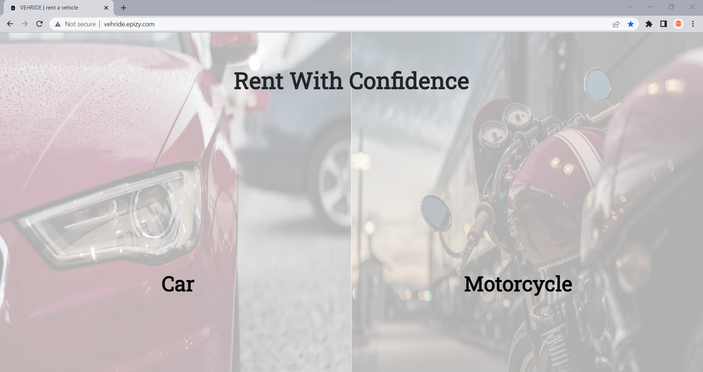
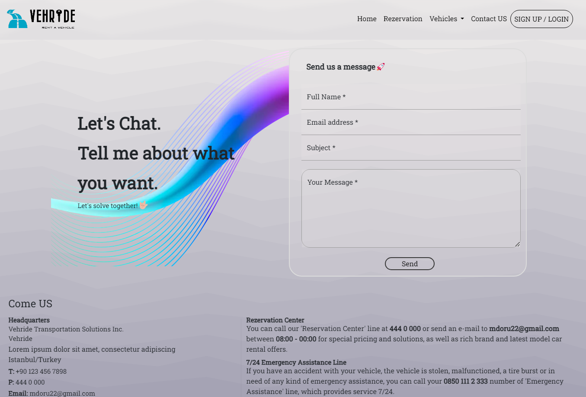
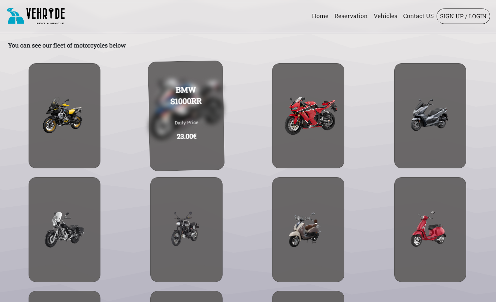
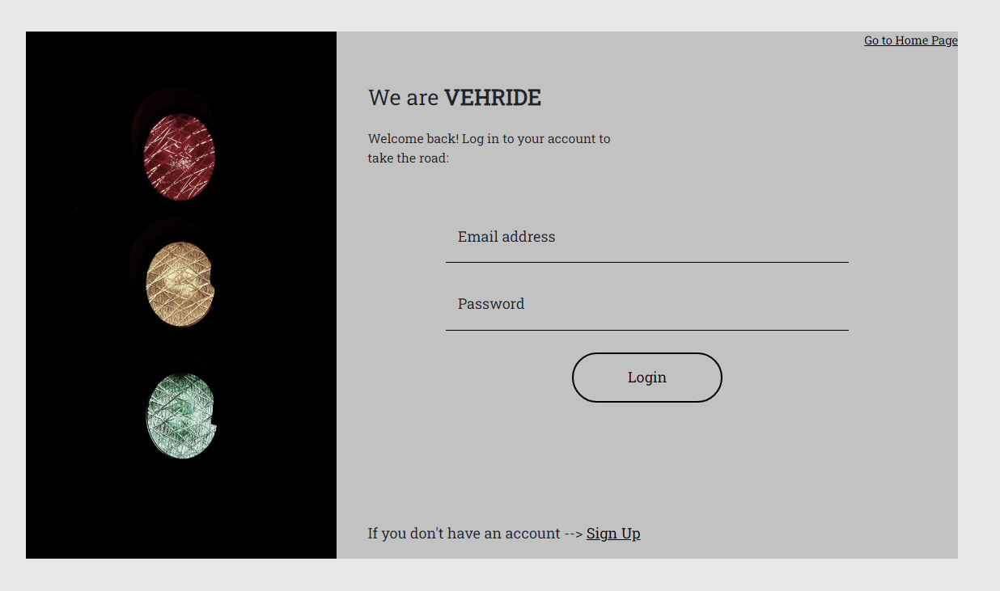
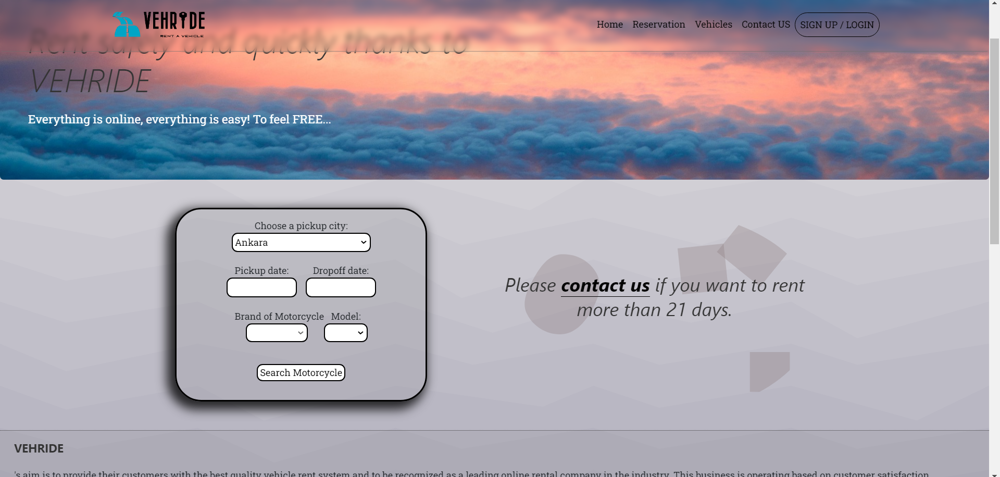

# Vehride | Rent a Vehicle

The website I made for the final project of a course I took in Erasmus.

This site was my first site building experience covering both frontend and backend. You can contact me about my shortcomings and things that need to be improved or for your advice.

## Technologies and Techniques  I use

- HTML5
- CSS3 - Bootstrap
- Javascript
- Php
- MySQL
- Ajax

  
## Demo

[You can click for the demo](https://vehride.mehmethandoru.com/) (sites: https://vehride.mehmethandoru.com/)

  
## Features

- Responsive design
- Saving and reading data to database

  
## Website Screenshots

  
## Support and Feedback

For support or feedback, email mdoru22@gmail.com or [you can contact with my linkedin](https://www.linkedin.com/in/mehmethandoru/)

